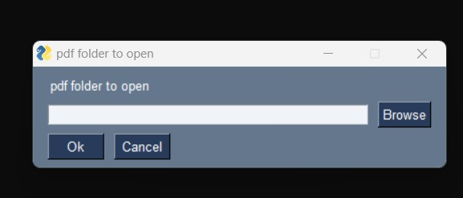
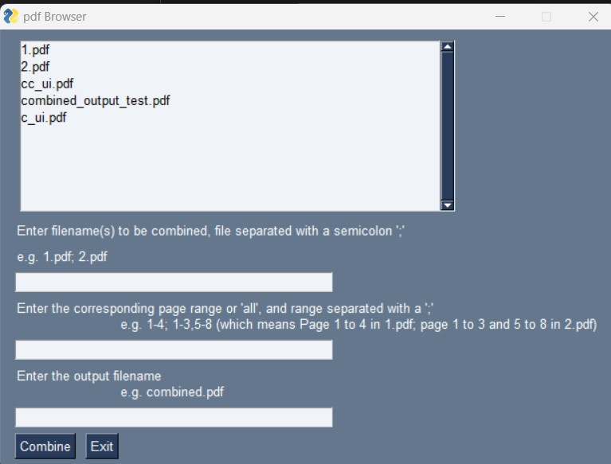
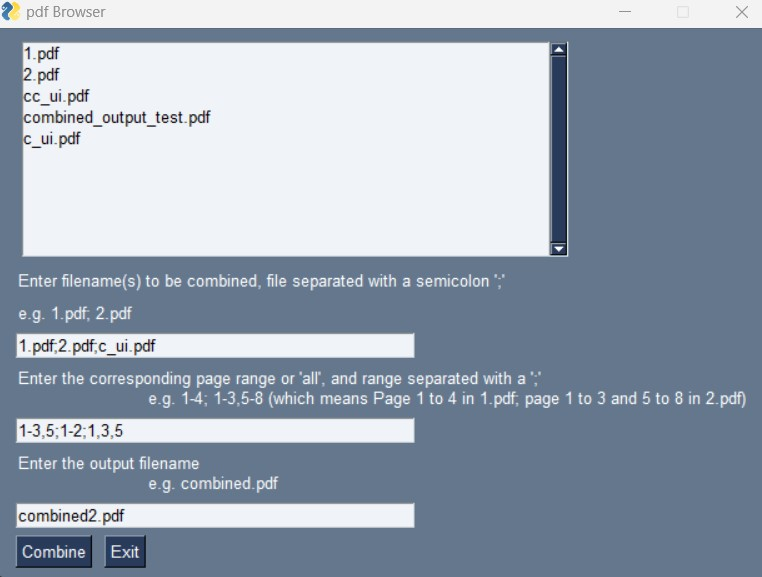
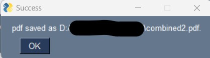
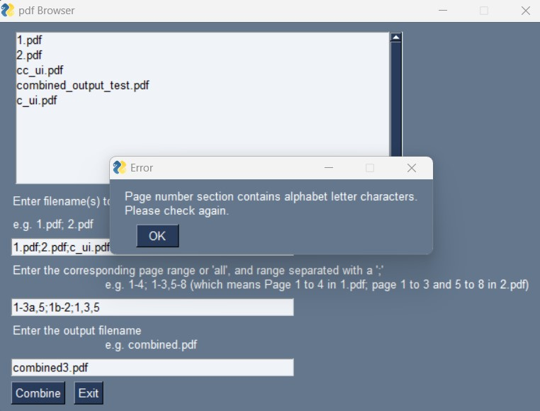

# Helper program - pdf-combiner

**pdf-combiner** is a helper program for you to combine pdfs without uploading your pdfs online. 
There is also a friendly UI for you to select input folder, page range for each pdf, and output filename.

You can use the software by downloading the `dist\` folder which contains all dependencies and you can start the software by running `dist\pdfCombiner\pdfCombiner.exe`.

## UI
Pop-up screen asking for the folder of the pdfs

Showing all the pdfs in the selected folder

Inputing pdf,  page range and output filename

Successful message pop-up

Sample error in page number

# References
PySimpleGUI

https://realpython.com/pysimplegui-python/

